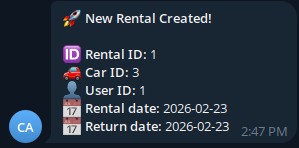
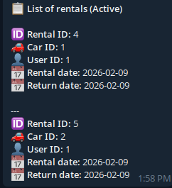
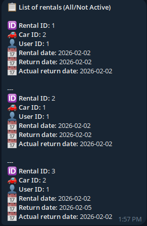

# 🚙 Carsharing Service

This is a modern RESTful API for a carsharing service, built with **Spring Boot 3**.

The project implements a full car rental lifecycle: from browsing a catalog of available vehicles to secure bookings and
payments.

---

## 💡 Key Features

- **🔒 Authentication (JWT):** Secure access using JWT tokens (Bearer Authentication).
- **🏎️ Car Catalog:** Full CRUD operations for vehicle management.
- **📝 Rental System:** Streamlined process for booking available cars.
- **💶 Payment Integration:** Secure transactions powered by **Stripe API**.
- **📃 Notifications:** Real-time updates via **Telegram Bot** regarding new rentals, returns, and overdue alerts.

---

## ⚙️ Technology Stack

- **Java 21**
- **Spring Boot 3.5.6**
- **Spring Security** (JWT)
- **Spring Data JPA**
- **MySQL**
- **Liquibase** (Database migrations)
- **Docker & Docker Compose**
- **Swagger UI** (OpenAPI 2.8.15)
- **JUnit 5 & Testcontainers**
- **Stripe SDK**
- **Telegram Bots Spring Boot Starter**

---

## 🛠️ Installation and launch

### 1️⃣ Local launch:

**Step 1.** Clone the repository:

````bash
git clone [https://github.com/Jelors/car-sharing-app-jlrs.git](https://github.com/Jelors/car-sharing-app-jlrs.git)
cd car-sharing-app-jlrs
````

**Step 2.** Install dependencies

````bash
mvn clean install
````

**Step 3.** Launch the app

````bash
mvn spring-boot:run
````

### 2️⃣Run via Docker:

To bring up the application along with the MySQL database with one command:

**Step 1.** Clone the repository:

````bash
git clone [https://github.com/Jelors/car-sharing-app-jlrs.git](https://github.com/Jelors/car-sharing-app-jlrs.git)
cd car-sharing-app-jlrs
````

**Step 2.** Launch all services:

````bash
docker-compose up -d
````

---

## 🪧 API Documentation (Swagger UI)

Once the app is running, explore and test the endpoints via Swagger UI:

🔗 http://localhost:8080/swagger-ui/index.html

### 📌 How to use

1. Registration: Complete the request to create an account.

````bash
POST auth/registration
````

2. Login: Complete the login request using your email and password.

````bash
POST auth/login
````

3. Token: Copy the received token from the response.
4. Authorization: Click the Authorize button in Swagger.
5. Login: In the Value field, paste the token and click Authorize.

Now you can use all the functionality of the service.


---

## 🪪 Role-Based Access Control

**✍ Note:** All endpoints are available to the user and are also available to the admin.
Also in specific endpoints that available both for CUSTOMER and MANAGER is available a check for access to critical
information.

### 🛂 ADMIN (MANAGER)

- Cars: Full control (POST, PUT, PATCH, DELETE).

- Users: Update user roles.

- Rentals: View all users' rentals.

- Payments: View all users' payments.

**Car controller:**

````bash
POST /cars - add a new to DB
PUT /cars/{ID} - update information about car
PATCH /cars/{ID}/inventory/increase - increase cars amount in inventory
PATCH /cars/{ID}/inventory/reduce - reduce cars amount in inventory
DELETE /cars/{ID} - delete car from DB
````

**User controller:**

````bash
PUT /users/{ID}/role - update user role
````

### 🚹🚺 USER (CUSTOMER)

- Rentals: Create a rental, return a car, and view personal rental history.

- User: Manage personal profile and update password.

- Payments: Create sessions and view personal payment history.

**Rental controller:**

````bash
POST /rentals - rent a car
POST /rentals/{ID}/return - set actual car return date
GET /rentals/{ID} - get specific rental by ID
GET /rentals - get list of rentals of a current user. Can be specified by user_id and is_active status
````

**User controller:**

````bash
GET /users - get profile information (current logged user)
PUT /users/me/info/updateProfile - update user profile
PUT /users/me/info/updatePassword - update user password
````

**Payment controller:**

````bash
GET /payments/{userId} - get all payments
GET /payments/{sessionId} - get payment by sessionId
POST /payments/{rentalId} - create payment checkout by rentalId
````

### 🔓 PUBLIC

- Auth: Registration and Login.

- Cars: View available cars.

**Authentication controller:**

````bash
POST /auth/registration - register a new user
POST /auth/login - authenticate user by email and password
````

**Car controller:**

````bash
GET /cars - receive information about all available cars
GET /cars/{ID} - receive information about specific car by car_id
````

## 🧮 Example of work

### Adding car to the database (POST /cars)

````json
{
  "model": "E-class",
  "brand": "Mercedenz-Benz",
  "dailyFee": 1648,
  "type": "SEDAN"
}
````

**Demonstration video:** https://www.loom.com/share/bdb54bf2b2f444f6b16a9f294175971a

**Screenshots from telegram bot:**

- Notification about every new rental



- Notification about all active rentals



- Notification about all/not active rentals



Also, at 10 a.m. every day bot will send you notification about all overdue rentals.

---

## 💾 Database Schema

The system uses a normalized MySQL schema including:

````
Relation Diagram
USER ||--o{ RENTAL : "has many"
USER }|--|{ ROLE : "has roles"
CAR ||--o{ RENTAL : "is rented in"
RENTAL ||--o{ PAYMENT : "generates"

    USER {
        Long id PK
        String email UK
        String firstName
        String lastName
        String password
        boolean isDeleted
    }

    ROLE {
        Long id PK
        Enum roleName UK
    }

    CAR {
        Long id PK
        String model UK
        String brand
        BigDecimal dailyFee
        Enum type
        int inventory
        boolean isDeleted
    }

    RENTAL {
        Long id PK
        LocalDate rentalDate
        LocalDate returnDate
        LocalDate actualReturnDate
        Long car_id FK
        Long user_id FK
        boolean isActive
        boolean isDeleted
    }

    PAYMENT {
        Long id PK
        Long rental_id FK
        String sessionId UK
        String sessionUrl
        BigDecimal total
        Enum status
        Enum type
        boolean isDeleted
    }

````

- **Users & Roles** (Many-to-Many) **||** User can have few roles, like CUSTOMER and MANAGER, and one role can relate to many users.

- **Users & Rentals** (One-to-Many) **||** One user can have many rentals. 

- **Cars & Rentals** (One-to-Many) **||** A specific car may appear in many rentals (at different time intervals).

- **Rentals & Payments** (One-to-Many) **||** A rental may have multiple payments (e.g. principal payment + late payment penalty)

---

## 🫶 Contacts

**GitHub:** https://github.com/Jelors

**Project Link:** https://github.com/Jelors/car-sharing-app-jlrs